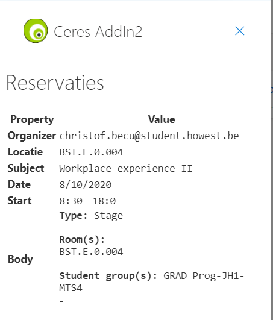
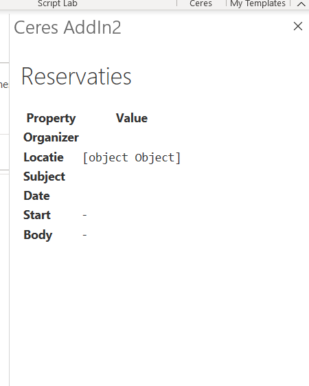

# Office API

- [Office API](#Office-API)
  - [Outlook REST API](#Outlook-REST-API)
    - [Api initializeren](#Api-initializeren)
    - [properties laden](#properties-laden)
    - [Bug](#Bug)
    - [Set properties](#Set-properties)
    - [Close add-in programmatically](#Close-add-in-programmatically)

## Outlook REST API

[official docs](https://docs.microsoft.com/en-us/previous-versions/office/office-365-api/)

### Api initializeren

```js
Office.onReady(function () {
        // Office is ready
        $(document).ready(function () {
            // The document is ready
            var item = Office.context.mailbox.item;
            loadItemProps(item);
        });
    });
```

### properties laden

```js
    function loadItemProps(item) {
        // Write message property values to the task pane
        $('#item-organizer-email').text(item.organizer.emailAddress);
        $('#item-location').text(item.location);
        $('#item-start').text(item.start);
        $('#item-date').text(item.start.getDate() + "/" + (item.start.getMonth() + 1) + "/" + item.start.getFullYear());
        $('#item-start-time').text(item.start.getHours() + ":" + item.start.getMinutes());
        $('#item-end-time').text(item.end.getHours() + ":" + item.end.getMinutes());
        $('#item-subject').text(item.subject);
        item.body.getAsync("text", function (result) { $('#item-body').text(result.value) });
    }
})();
```

- Javascript month start op 0, dus + 1
- body: getAsync(CoercionType, callback)

### Bug

Web versie van outlook vs desktop versie




[Locally debugging Office Add-ins errors with “We can’t open this add-in from localhost”](https://brettmckenzie.net/2020/03/02/locally-debugging-office-add-ins-errors-with-we-cant-open-this-add-in-from-localhost/)

`Unhandled exception at line 4055, column 3 in https://localhost:44374/Scripts/jquery-3.5.0.js
0x800a138f - JavaScript runtime error: Unable to get property 'displayName' of undefined or null reference`

Build settings: 

- project url: http://localhost:5363/
- override application root url : https://localhost:5363/

---

### Set properties

e.g.

```javascript
Office.context.mailbox.item.subject.setAsync(eventTitle.value, function () { });
Office.context.mailbox.item.location.setAsync(eventRoom.value, function () { });
```

### Close add-in programmatically

```javascript
Office.context.ui.closeContainer();
```javascript